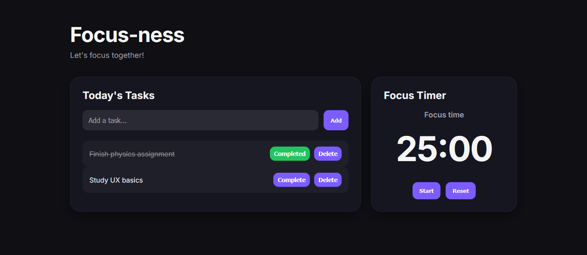

# Focus-ness — UX Study Dashboard

Focus-ness is a productivity web app designed to help students manage academic tasks and stay focused using a Pomodoro timer.

This project was built to practice UX design and frontend development skills, including user interaction, state management, and basic product thinking.

---

## UX Case Study

### Why I made this

I built Focus-ness because studying often feels more chaotic than it should. Most tools either try to do too much or end up distracting you more than helping.

I wanted something simple, just tasks and a focus timer, nothing extra getting in the way.

---

### What I was trying to solve

I kept running into the same problems: jumping between too many tasks at once, losing focus quickly while studying, not having a clear structure for my time...etc.

So the goal became pretty simple: make something that helps you stay on track without overthinking it.

---

### How I approached it

I started small. Just two things: a place to quickly write tasks and a timer for focused work sessions

Everything else was built around keeping those two things easy to use.

I didn’t want complicated menus or features that look good but don’t get used.

---

### Design choices

Most of the decisions were about keeping things out of the way rather than adding more.

- dark interface so it feels less harsh during long sessions  
- large timer so focus stays on time, not controls  
- simple interactions (click or press Enter and move on)  
- immediate feedback so every action feels clear  

---

### Where it got tricky

The timer logic was the most annoying part.

Handling start, pause, and resume sounds simple, but it gets messy quickly if you don’t structure it properly. I ended up simplifying the whole thing into a clear state system instead of trying to juggle multiple conditions at once. That made everything easier to control.

---

### What I ended up with

A small productivity tool that focuses on doing a few things properly instead of trying to be a full system.

It’s not meant to be complex, it's meant to be something that helps you focus and get through work.

---

## Live Demo
https://coding-collab03.github.io/Focus-ness/

---

## Problem

Students often struggle with:
- Managing multiple courses and deadlines
- Staying focused during study sessions
- Lack of simple planning tools

Focus-ness is designed to reduce this complexity with a minimal and focused interface.

---

## Solution

The app includes:
- Task management (add, complete, delete tasks)
- Pomodoro timer for focused study sessions
- Simple interface without distractions
- Keyboard support for faster input (Enter to add tasks)
- Clear visual feedback for user actions

---

## Tech Stack

- HTML
- CSS (Flexbox and Grid)
- JavaScript (Vanilla)
- Git and GitHub Pages

---

## Features

### Task System
- Add tasks dynamically
- Mark tasks as completed
- Delete tasks
- Add tasks using the Enter key

### Focus Timer
- 25-minute Pomodoro timer
- Start, pause, and resume functionality
- Reset option
- Live countdown display

---

## What I Learned

- DOM manipulation with JavaScript
- Event handling and user interactions
- Basic UI state management
- UX principles like feedback and simplicity
- Structuring a frontend project
- Deploying a static site with GitHub Pages

---

## Future Improvements

- Save tasks using local storage
- Drag and drop task reordering
- Dark and light mode
- Session tracking
- Improved mobile responsiveness

---

## Preview

---

## Author

Built by Layal as a personal UX and frontend learning project.
